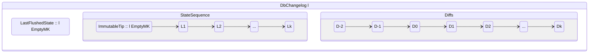
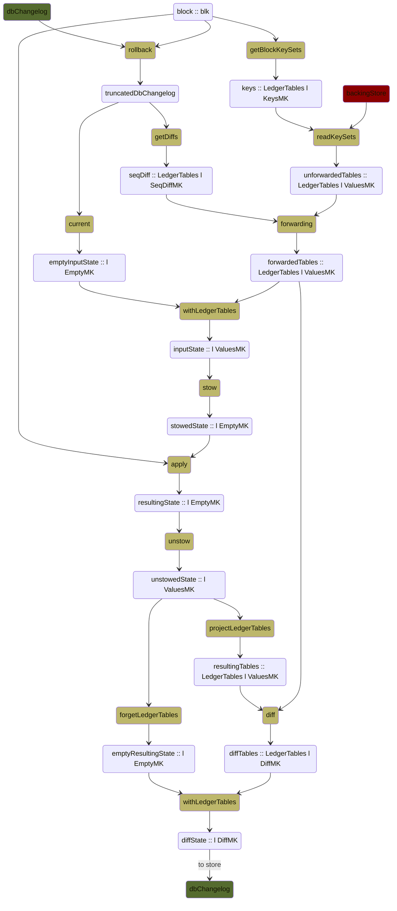

# UTxO-HD for developers

This document aims to provide a guide on how to integrate the UTxO-HD
implementation into downstream clients.

Clarification requests and questions are more than welcome.

## Why UTxO-HD

Over time, `cardano-node` memory usage has been steadily increasing.
Synchronizing from scratch with mainnet shows that currently the node uses
around 16GBs of memory at the peak. Not every user of the Cardano blockchain has
a computer with that much memory and therefore it becomes necessary to lower the
memory of the running node.

A big chunk of that memory is consumed by mantaining the UTxO set, with its many
millions of entries. UTxO-HD solves this by extracting this set from the ledger
state and dumping it into the disk. This effectively lowers the memory by 5GB
(tentative numbers shown by ad-hoc benchmarks, should not be considered exact).
However this comes at a cost, both in speed performance and in complexity of the
code.

This design is based on the technical report ["Storing the Cardano ledger state
on disk: analysis and design options"](../utxo-db/utxo-db.tex) by Duncan Coutts
and Douglas Wilson.

## Implementation

The Ledger rules that are involved when applying a block on top of a ledger
state only need to consult the UTxOs that are consumed by that block (and
produce UTxOs that were not present in the UTxO set of the input state). This
makes it possible to leave the [Ledger
code](https://github.com/input-output-hk/cardano-ledger) unaltered (at least in
this first implementation): we only need to provide ledger states to the ledger
rules in which the UTxO set is just a subset/restriction to the values required
to apply a block which is usually small. Getting these subsets from disk and
ensuring their consistency is a task for the Consensus layer.

The way Consensus solves this is by maintaining _differences/deltas_ (`Diff` or
`Delta` in the implementation) for each block, that can be used to later on
construct a suitable ledger state (operation that we named _hydrating the ledger
state_). In case you are planning on manipulating deltas on your own, note that
there is some algebraic structure to them, see [their
docs](https://github.com/input-output-hk/anti-diffs/blob/main/diff-containers/README.md).

A ledger state is no longer a inscrutable data structure from the Consensus
point of view, but instead we might need at different points to associate it
either with plain UTxO entries (when applying a block), with deltas (when
keeping track of the changes with regards to the previous ledger state) or even
we sometimes need to detach the ledger state from any mention to the UTxO
entries, if we are only interested in other parts of the state. For this reason,
we parametrized the Ledger state over _mapkinds_ modelling the different types
of the data attached to the state, roughly:

| `MapKind :: Type -> Type -> Type` | Container                     | Used for                                             |
|-----------------------------------|-------------------------------|------------------------------------------------------|
| `ValuesMK k v`                    | `Map k v`                     | Creating ledger states for the Ledger rules          |
| `KeysMK k v`                      | `Set k`                       | Querying the disk for the values needed by a block   |
| `DiffMK k v`                      | `Map k (Delta v)`             | Carrying the differences created by applying a block |
| `SeqDiffMK k v`                   | `Fingertree SlotNo (Map k v)` | Carrying the differences for the last `k` blocks     |
| `EmptyMK k v`                     | $\emptyset$                   | When not needing info about the UTxO set             |
| `TrackingMK k v`                  | `(Map k v, Map k (Delta v))`  | Carrying both `ValuesMK` and `DiffMK`                |

After UTxO-HD, `LedgerState blk` is now parametrized by a `MapKind` that
indicates what kind of information is there with regards to the UTxO set. This
information is sometimes needed in isolation, detached from the ledger state,
and for that we have a newtype named `LedgerTables`.

```haskell
type LedgerState :: Type -> MapKind -> Type
data family LedgerState blk mk

type LedgerTables :: (Type -> MapKind -> Type) -> MapKind -> Type
newtype LedgerTables l mk = LedgerTables {
    getLedgerTables :: mk (Key l) (Value l)
  }
```

### Keeping the ledger states in memory (the ~LedgerDB~ DbChangelog)

If we were to store only the resulting ledger state after applying a block, we
would lose track of what values were consumed. On the other hand, if we kept a
UTxO set next to each ledger state, we would just defeat the purpose of UTxO-HD.
To solve this, we keep one copy of the UTxO set at some immutable block (usually
the immutable tip, but not necessarily) and then the differences of each
volatile block. Moving that copy of the UTxO set to disk is what achieves the
memory decrease that we were seeking with this project.

For efficiency reasons, instead of keeping a sequence of states carrying a
`DiffMK` each, we keep two sequences: one of `EmptyMK` ledger states and one
with all the `DiffMK`s grouped into a modified
[`FingerTree`](https://github.com/input-output-hk/anti-diffs/tree/main/fingertree-rm).

This need for a different data structure to hold the history of Ledger states
prompted us to use a `DbChangelog` instead of the pre-UTxO-HD `LedgerDB`.
Together with a pointer to the data in the disk, this is functionally equivalent
to the old `LedgerDB` contents.

```haskell
data DbChangelog l = DbChangelog {
    changelogLastFlushedState :: !(l EmptyMK)
  , anchorlessChangelog       :: !(AnchorlessDbChangelog l)
  }
  
data AnchorlessDbChangelog l = AnchorlessDbChangelog {
    adcLastFlushedSlot :: !(WithOrigin SlotNo)
  , adcDiffs           :: !(LedgerTables l SeqDiffMK)
  , adcStates          :: !(StatesSequence l)
  }
  
type StatesSequence l = 
  AnchoredSeq (WithOrigin SlotNo) (l EmptyMK) (l EmptyMK)
```



In this diagram, `D1` corresponds to the delta resulting between the states
`ImmutableTip` and `L1`, `D2` is the delta between `L1` and `L2`, and so on.
Notice the existence of deltas with negative numbers. These are the deltas
belonging to the (already garbage-collected as they are not needed) immutable
states between the `LastFlushedState` and the `ImmutableTip`.

The sequence of differences is kept in a `FingerTree` as mentioned above.
Pushing and splitting this sequence is one of the main causes of speed loss in
the node. In order to not traverse the whole `FingerTree` every time we need to
use the deltas, the modified `FingerTree` keeps a root measure that is the
combination of all the deltas so that we can just apply that, but it comes at a
cost as we are pushing only one element into the `FingerTree` after each block,
and splitting a `FingerTree` is already a costly operation.

One might think: why then keep this sequence at all? There are the reasons
mentioned at the beginning of this section but there is also a crucial one for
the well-functioning of the node: we need to be able to quickly consult any of
the last `k` ledger states in order to evaluate forks and roll-back the chain if
necessary. Using this sequence, we are able to re-construct a `k`-recent Ledger
state suitable for these purpose.

### The Backing Store (on-disk store)

As you might have noticed in the diagram above, we only keep track of
differences in the `DbChangelog`, but at some point these differences must have
a base value/anchor on top of which we can apply them. This anchor is an
instance of the whole UTxO set (in particular the UTxO set at the last flushed
state) that we keep in what we named the [_backing
store_](../../../ouroboros-consensus/src/ouroboros-consensus/Ouroboros/Consensus/Storage/LedgerDB/BackingStore.hs).
In order to manipulate the Backing Store, we produce a
`BackingStoreValueHandle`, see the previous link for more details.

On top of the values that exist in the backing store, the sequence of
differences in the LedgerDB can be applied to create a UTxO set at a specific
slot younger than the one in the backing store.

Functionally it is just a key-value store (plus the `SlotNo` of the last
flushed state), and we provide two implementations:

- [InMemory](../../../ouroboros-consensus/src/ouroboros-consensus/Ouroboros/Consensus/Storage/LedgerDB/BackingStore/InMemory.hs):
  is a `Data.Map` that lives in a `TVar`.
- [LMDB](../../../ouroboros-consensus/src/ouroboros-consensus/Ouroboros/Consensus/Storage/LedgerDB/BackingStore/LMDB.hs)
  uses [LMDB](http://www.lmdb.tech/doc/) bindings to keep a database in a file in the disk.

To be precise, only the LMDB implementation will decrease the memory usage by
moving this instance of the UTxO set to disk, but it comes at a cost as I/O has
to be performed to read and write values. We expect SPOs with powerful machines
to use the InMemory implementation and every other user to move to the LMDB
implementation.

### Backing store views

In particular operations, like answering queries or in the forging loop, we need
to make sure that we are able to complete the operation, and for that we need
the values in the backing store to remain unaltered for the duration of the
process. For this goal, we use a
[`LedgerDBView`](../../../ouroboros-consensus/src/ouroboros-consensus/Ouroboros/Consensus/Storage/LedgerDB/BackingStore.hs)
which is an immutable view on the backing store values plus a `DbChangelog` that
can be used to perform forwarding operations. We take advantage of the fact that
the backing store implementations can provide a consistent view of the stored
values while accepting updates in other threads.

### Applying blocks

From the point of view of the communication with the Ledger rules, it turns out
that for each block we need a way to inject (and project) the ledger tables into
the actual ledger state so that we can continue using the Ledger code without
modifications. As the Ledger ledger-state type depends on the type of the block
(`ChainValidationState` for Byron, `NewEpochState` for Shelley and
`HardForkLedgerState` for the `HardForkBlock`), each block type defined in the
Consensus layer has to provide a way to do so.

The Consensus-Ledger API makes use of this projection/injection functions for
each block type (i.e. needs the instance `CanStowLedgerTables (LedgerState
blk)`), and it defines a general flow for **applying a block: a ledger state
with some values (`ValuesMK`) goes in and a ledger state with the corresponding
deltas (`DiffMK`) comes out**. This is reflected in the
`(re)applyBlockLedgerResult` functions:

```haskell
applyBlockLedgerResult ::
     HasCallStack
  => LedgerCfg l
  -> blk
  -> Ticked1 l ValuesMK
  -> Except (LedgerErr l) (LedgerResult l (l DiffMK))
```

To provide a `LedgerState` with values (`ValuesMK`) to the Ledger, we need to
follow this sequence of steps:

1. Consult which UTxOs the block will need (`getBlockKeySets`).

2. Read those from the BackingStore (module `ReadsKeySets`).

3. Apply the diffs in the sequence of deltas in memory up to the desired slot (
   `forwardTableKeySets`).

4. Inject the deltas into the ledger state and call the desired Ledger rule.

This read and forwarding is another of the main sources of speed loss in the
node. Before UTxO-HD, the values were just in memory already so we didn't need
to do any further work to bring them in. Now we even have (depending on the
backing store chosen) to perform I/O to read those.

Here we present a diagram in which the yellow nodes are operations, and the
`DbChangelog` and `BackingStore` are depicted with colors.



### Era boundaries

In general, ticking a ledger state should not modify the values in the UTxO set,
but there are two exceptions in the Cardano case when ticking crosses an era
boundary. For this reason, the general scheme for **ticking a block is: a ledger
state without a UTxO set (`EmptyMK`) goes in and a ledger state with some deltas
(`DiffMK`) comes out**. This is reflected in `applyChainTickLedgerResult`.

```haskell
applyChainTickLedgerResult ::
     LedgerCfg l
  -> SlotNo
  -> l EmptyMK
  -> LedgerResult l (Ticked1 l DiffMK)
```

### Ticking and era boundaries

In general, ticking a ledger state won't modify the values in the UTxO set, but
there are two exceptions in the Cardano case when ticking crosses an era
boundary: 

- For simplicity, we have deliberately chosen that the Byron era would not have
  any ledger tables, and there would only be ledger tables starting in Shelley.
  This means that when crossing the boundary to Shelley, the whole UTxO set will
  be returned as deltas (see `translateLedgerStateByronToShelleyWrapper`
  [here](../../../ouroboros-consensus-cardano/src/ouroboros-consensus-cardano/Ouroboros/Consensus/Cardano/CanHardFork.hs)).

- In the Shelley to Allegra transition, a bunch of UTxOs (owned by the AVVM
  addresses) were consumed into the treasury. This transition will return said
  UTxOs as deletions (see `translateLedgerStateShelleyToAllegraWrapper`
  [here](../../../ouroboros-consensus-cardano/src/ouroboros-consensus-cardano/Ouroboros/Consensus/Cardano/CanHardFork.hs)).

The general scheme for **ticking a block is: a ledger state without a
UTxO set (`EmptyMK`) goes in and a ledger state with some deltas (`DiffMK`)
comes out**. This is reflected in `applyChainTickLedgerResult`.

```haskell
applyChainTickLedgerResult ::
     LedgerCfg l
  -> SlotNo
  -> l EmptyMK
  -> LedgerResult l (Ticked1 l DiffMK)
```

As one might have noticed, the diagram for applying a block is missing the
ticking step, but it would complicate the diagram too much. The actual flow is:

- The `emptyInputState` is ticked, producing a `Ticked1 l DiffMK`.
- The `forwardedTables` are also forwarded through the diffs coming from
  ticking.
- The diffs from ticking are prepended to the resulting diffs before being
  stored in the `DbChangelog`.

### The mempool

The mempool behaves pretty much as a virtual block. The design is not
particularly complex as we just ask the backing store for the inputs for a
transaction when applying it. The only caveat compared to the pre-UTxO-HD
implementation is that previously it cached the latest ledger state and
therefore we could run a separate thread that would sync the mempool with the
LedgerDB and revalidate all the transactions when necessary, but now we might
not be able to apply a transaction if the ledger state on top of which we had
applied the others is now gone from the LedgerDB. Therefore, adding a
transaction might in some cases trigger a sync with the LedgerDB and therefore a
revalidation of the previous transactions.

### Ledger state queries

Most of the queries don't require the UTxO set but there are three in particular
that do: `GetUTxOByTxIn`, `GetUTxOWhole` and `GetUTxOByAddress`. We assume that
`GetUTxOWhole` is a debug query so we don't pay much attention to it as we
expect it will be used with small-ish UTxO sets. For `GetUTxOByTxIn`, the story
is simple, query the Backing store for the `TxIn` and forward it through the
sequence of diffs.

However, it is `GetUTxOByAddress` that poses a real problem, as we need to query
the whole UTxO set, apply all the differences to it and then traverse it
entirely to find out the UTxOs belonging to an address. This query is now quite
slow and in fact its usage is discouraged. It should not be a responsibility of
the node to maintain access to this if it is not needed by the logic that runs
the blockchain, so the plan is to move this into a separate process/client that
runs an index of UTxOs by address that can provide fast access to it (see [#4678](https://github.com/input-output-hk/cardano-node/issues/4678)).

Currently, a pre-UTxO-HD node performs this query in 7 seconds, but our ad-hoc
measurements have shown that a UTxO-HD node takes ~40 seconds when using the
InMemory backend and ~90 seconds when using the LMDB backend.

### The hard-fork tables

It is worth mentioning one important caveat that has given us quite a lot of
headaches while developing UTxO-HD. When a blockchain is running a
`HardForkBlock` (as Cardano does), the overall type of the data stored in the
`DbChangelog` and in the `BackingStore` are maps from some key type into an
N-ary sum of value types (one for each era). 

But applying a block in a particular era requires a ledger state in said era.
Whenever we inject `HardForkBlock` ledger tables into the ledger tables of the
particular era, we translate the inputs that belong to previous eras and we
unwrap the N-ary sum value effectively duplicating the map in which they are
contained.

This is fine in the Consensus use case because the set of inputs for each block
will be quite small. However this imposes an important restriction, one cannot
just simply project in and out the whole UTxO set on every ledger state (and not
mantain a sequence of differences) to do a preliminary integration of UTxO-HD
because this effectively tri-plicates the whole UTxO set on every block which
blows up the memory. Below we present a solution to this by using the
`LegacyBlock` wrapper.

## How can I update my code to use UTxO-HD

In these early phases, you can choose whether to update your code to UTxO-HD or
simply mock all the operations - for the latter we provide a new package that you
might want to use.

### A) I don't want to use UTxO-HD yet

Wrapping your block applications into `LegacyBlock` from the
`ouroboros-consensus-cardano-legacy-block` package will result in all the
UTxO-HD operations being mocked and in principle you should not see any big
performance loss (you would essentially be keeping just a fingertree of empty
values on top of a pre-UTxO-HD node). This was successfully done already by
`db-sync` and we used this in the implementation of the `cardano-api`
`foldBlocks` function (see the `Legacy.` functions used
[here](https://github.com/input-output-hk/cardano-api/blob/06b35ea6bf2be148eaf59d60df7bb1ad309e26b9/cardano-api/internal/Cardano/Api/LedgerState.hs#L1397)),
so you might want to look there on how to do it.

### B) I want to use UTxO-HD

Then this is a vague list on the things that you will have to take into account:

- You will need something to store a sequence of differences. Either use the
  `DbChangelog` or roll out your own solution.
- You will need something to store the UTxO set, à la `BackingStore` (or you
  could use one of our implementations).
- Every reference to `LedgerState blk` will change its kind.
- If applying blocks, you will have to provide some way of injecting values into
  the UTxO of the ledger state. You will have to implement basically reading of
  keys, forwarding through some kind of `DbChangelog` and injection into the
  ledger state.
- Applying a block will return a set of differences that you will have to keep
  somewhere or apply on top of the latest ledger state.

This is not very accurate as we have not yet had downstream clients integrating
this, but please do not hesitate on contacting us, the Consensus team, for any
inquiries or doubts you may have.
